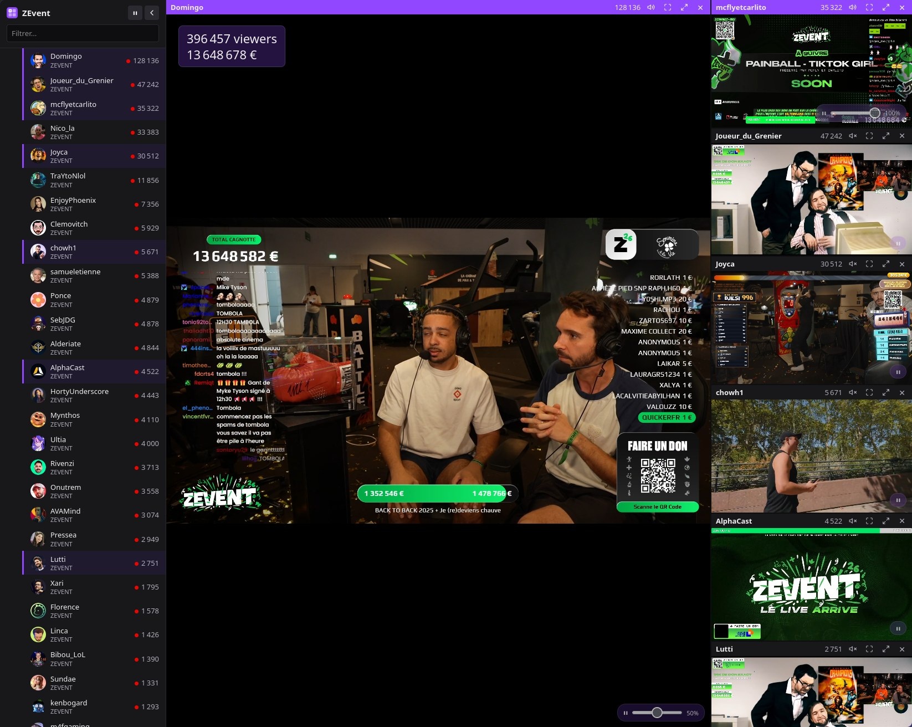

# ZEvent grid

A one-page multi-stream viewer for [ZEvent](https://zevent.fr). Pick streamers from the live list, lay them out in a grid, spotlight one, and watch the cagnotte climb in real time.



## Features

- **Live streamer list** from zevent.fr, sorted by viewers, filterable, refreshed every 15 seconds.
- **Grid you own**: drag tiles to reorder, spotlight one stream next to a column of the others, native fullscreen on any tile.
- **Sound that stays put**: per-stream mute, volume and play/pause, a global play/pause, and every setting survives a reload.
- **Nothing plays off-screen**: tiles that scroll out of view pause, with a short delay so a relayout never cuts a stream.
- **A counter that never stalls**: viewers and donations update live, and the amount is animated to follow the real donation rate instead of jumping every poll.
- **No dependencies**: one HTML file and a stdlib Python server that proxies `zevent.fr/api` (the upstream sends no CORS header).

## Run

```bash
python3 server.py        # http://localhost:8765
python3 server.py 9000   # another port
```

Open the URL in a browser, tick streamers on the left, done. The Twitch player only loads from a real hostname, so keep `localhost` rather than `file://`.

## Notes

- Browsers refuse audible playback until you click the page once. Tiles start muted, a hint says so, and the first click applies the saved sound state.
- Every stream is a Twitch embed with its controls hidden, so the buttons on each tile are the only controls. Fifteen embeds at once is heavy: a laptop will not enjoy it.
- The page reloads itself when `index.html` changes on disk, which is handy while editing and harmless otherwise.

## License

[MIT](LICENSE)
